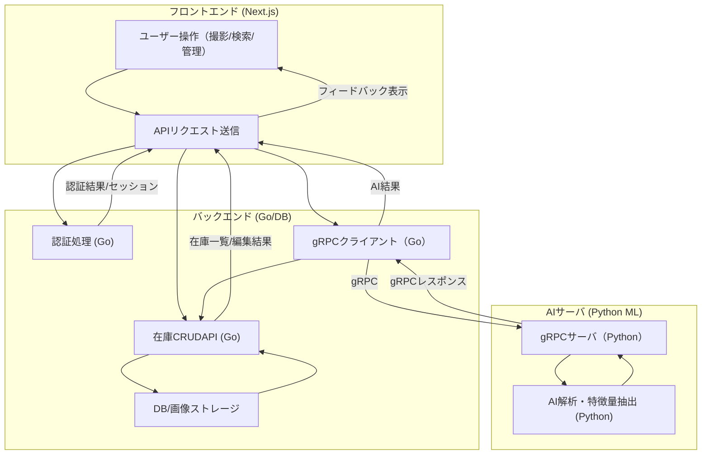

# Daburi Zero — 仕様書
「これ、家にあったっけ？」「家にあるのにまた同じものを買ってしまった。。。」を画像検索で解決する、うっかり重複買い防止プラットフォーム

## 概要
「Daburi Zero」は、洗剤、調味料、掃除用具など、日用品の「ダブリ買い」をゼロにするための管理アプリです。本サービスでは、「画像（パッケージデザイン）そのもの」をベクトル化して検索することで、在庫状況を照合する体験を提供します。

# 1.要件サマリ
- 商品を撮影するだけで在庫登録・検索ができること
- 画像の類似度（特徴量ベクトル）に基づいて、既存在庫との一致を判定すること
- 在庫の有無を「％（類似度）」と「画像比較」で直感的にユーザーへ伝えること
- 外出先（オフラインに近い環境）でも高速に検索結果を返せること

## 機能 (MVP)
1. 認証・セッション管理 (Redis)
    - ID/パスワードによる認証。
    - ログイン成功後、セッションIDを発行しRedisに保存する。
    - 以降のリクエストはRedis上のセッション情報で認可を行う。

2. 自宅備品マネジメント (CRUD)
    - 商品登録 (Create)：
        - スマホで商品を撮影 → 商品名をそのままAIが登録する。商品名入力すらも無くしたい。
        - Pythonでベクトル化し、メタデータと共に保存。
    - 在庫一覧・詳細 (Read)：
        - 登録した商品をリスト表示。
        - 商品からどういう要素をカラムとして持たせるか
    - 在庫編集 (Update)：
        - ストックが切れたのでなしにする。商品名を変えるなどの操作ができる。
    - 在庫削除 (Delete)：
        - 使わなくなったアイテムの削除。

3. 店頭照合機能
- リアルタイム検索：
    - 店頭で「これ持ってたっけ？」と思った時にカメラで撮影。
    - 「今撮った写真」 と 「DB内の全在庫ベクトル」で高速類似度検索。
- 判定フィードバック：
    - 持っています（類似度95%：画像表示）
    - 似たものがあります（類似度75%：以前撮った画像と並べて比較）
    - 持っていないようです（類似度低）」といった結果を表示。

## 使用技術
1. バックエンド / AWS
- 言語：Go
- 認証・セッション：Redis
- データベース：PostgreSQL + pgvector (画像ベクトルの高速検索を実現)
- 通信プロトコル: gRPC + Protocol Buffers (Go-Python間の高速・型安全な通信)
- ストレージ：MinIO または AWS S3 (撮影した画像データの保存)

2. 機械学習解析 (Python ML Server)
- 言語：Python(Deep Learningライブラリが豊富なため)
- 特徴量抽出: PyTorch + Vision Transformer (ViT) (パッケージの類似性を数値化)
- 商品名抽出 (OCR/VLM):
    - EasyOCR: 文字があるパッケージから名前を抜く。
    - Moondream2 または Llama-3.2-Vision: 文字がない掃除用具などの名前を推論。
- API：gRPC Server (Goからの解析依頼を待ち受ける)

3. フロントエンド
- フレームワーク: Next.js (TypeScript)
- スタイリング: Tailwind CSS
- カメラ機能: react-hook-form + カスタムフック (スムーズな撮影・アップロード体験)


# 2. 全体図


# 3. ディレクトリ構成
backend
```
go-backend/
├── cmd/
│   └── api/
│       └── main.go           # エントリーポイント (DI、ルーティング設定、サーバー起動)
├── internal/
│   ├── domain/               # ビジネスロジックの中心 (外部ライブラリに依存しない)
│   │   ├── entity/           # エンティティ & 値オブジェクト
│   │   │   ├── user.go       # User Entity, UserId ValueObject
│   │   │   └── face.go       # FaceEmbedding ValueObject
│   │   ├── repository/       # リポジトリの「インターフェース」定義
│   │   │   ├── user_repo.go
│   │   │   └── face_repo.go
│   │   └── service/          # ドメインサービス (純粋なドメインロジックがあれば)
│   │       └── similarity.go # 例: 類似度判定の閾値ロジックなど
│   │
│   ├── usecase/              # アプリケーションロジック
│   │   ├── user_usecase.go   # "ユーザー登録する" などの処理フロー
│   │   ├── match_usecase.go  # "画像を元に類似ユーザーを探す" フロー
│   │   └── inputport/        # UseCaseへの入力データの定義 (DTO的な役割)
│   │
│   ├── controller/            # 入出力の変換 (Controller/Presenter)
│   │   ├── http/             # REST API ハンドラ (Echo/Ginなど)
│   │   │   ├── handler.go
│   │   │   ├── request.go    # JSONリクエストの構造体
│   │   │   └── response.go   # JSONレスポンスの構造体
│   │   └── websocket/        # チャット用 WebSocket ハンドラ
│   │
│   └── infrastructure/       # 技術的な詳細実装 (DB, 外部API)
│       ├── persistence/      # リポジトリの実装、永続化処理 (PostgreSQL + pgvector)
│       │   ├── db.go
│       │   ├── user_repo_impl.go
│       │   └── face_repo_impl.go
│       ├── grpc/             # PythonサービスへのgRPCクライアント実装
│       │   └── face_client.go
│       └── router/           # Webフレームワークのルーティング設定
│
├── pkg/                      # プロジェクト外でも使える汎用ユーティリティ (Logger, Errorなど)
├── api/                      # gRPCの .proto ファイル定義
│   └── proto/
│       └── face_service.proto
├── go.mod
└── go.sum
```

frontend
```
src/
├── app/                        # 1. ルーティング (Next.js App Router)
│   ├── layout.tsx              # 全体共通（フォント、ヘッダー、フッター）
│   ├── page.tsx                # ランディングページ (Desktop-2)
│   ├── login/
│   │   └── page.tsx            # ログイン画面 (Desktop-1)
│   ├── signup/
│   │   └── page.tsx            # 新規登録画面
│   └── onboarding/
│       └── page.tsx            # 登録後フロー (名前入力、顔登録など)
├── components/                 # 2. ロジックを持たない共通UI部品
│   ├── Button.tsx              # Tailwindで装飾したボタン
│   ├── Input.tsx               # 入力フォーム部品
│   └── Card.tsx                # 白い枠線などの共通コンテナ
├── features/                   # 3. 画面（機能）ごとのロジックと部品
│   ├── common/                 # 複数機能で使うロジック入り部品
│   └── routes/                 # 特定ページ専用のコンポーネント
│       ├── auth/               # ログイン・新規登録用
│       │   ├── components/     # LoginForm.tsx, SignupForm.tsx
│       │   ├── hooks.ts        # ログイン処理、バリデーション
│       │   └── endpoint.ts     # Go APIを叩く関数 (Infrastructure)
│       └── onboarding/         # 登録後のステップ用 (FigmaのDesktop-14等)
│           ├── components/     # NameForm.tsx, FaceUpload.tsx
│           ├── hooks.ts        # ステップ管理、アニメーション制御
│           └── endpoint.ts     # プロフィール保存API
├── hooks/                      # 4. プロジェクト全体で使うReact Hooks
├── utils/                      # 5. 純粋な関数（日付変換、エラー処理など）
└── constants/                  # 6. 定数（APIのベースURL、文言など）
```

<!-- websocketによるチャット機能をfrontendのflowchart LR追加する -->

# 4. 処理の流れ
### ① Frontend → Go API
- 画像アップロード
    - Next.js から顔画像をアップロードする
    - 画像は multipart/form-data 形式で送信される
    - 認証済みユーザーのみ利用可能とする

### ② Go → Python (gRPC)
画像をGo APIからPythonサーバへ送る。
Pythonは以下のものを担当する。
- 顔検出（Vision API）
- 顔前処理 (アライメント)
- 512次元 embedding 抽出

### ③ Python → Go (gRPC)
- 解析結果の返却
    - 顔 Embedding（512次元ベクトル）

### ④ 類似度検索をGoが行う
- 検索および永続化
Go APIは以下を担当します。
- 受け取ったEmbeddingをデータベースに保存
    - ベクトル検索：pgvector
- 顔検索時は、Embeddingを用いて類似度計算を実行
- 類似度順にユーザーをソート (TOP N抽出)
※ 類似度検索のロジックはGo側で一元管理する。

### ⑤ Go → Frontend
- 検索結果の返却
    - 類似度順に並んだユーザー一覧
    - 顔サムネイル
    - 最低限のプロフィール情報
    - 類似度指標 (相対スコア)
Frontedは結果を表示し、ユーザーは気になった相手に1日3件までメッセージを送ることができる。

# 4-1. 機能要件

# 4-2. 非機能要件

# 5. アーキテクチャ詳細 (クリーンアーキテクチャ & DDD の採用)


# 6. フロントエンド仕様 (Next.js+TypeScript)
## 主要ページ

## なぜNext.jsを採用するか、Reactとの比較

## TypeScriptを採用する理由

# 7. バックエンド仕様 (Go)
## GolangとPythonの比較

<!-- あとで詳細図で別に飛ばす -->
# 8. 顔認証/顔類似性サービス (Python)

<!-- あとで詳細図で別に飛ばす -->
# 9. API仕様書 (REST for frontend, gRPC for service間)

<!-- あとで詳細図で別に飛ばす -->
# 10. DBデータモデル

# 11.コミットメッセージについて(12/21〜)
コミットメッセージが適当だったのでいかを基準にします。
- add: 新しい機能
- fix: バグの修正 (ほぼないかも)
- docs: ドキュメントの変更
- update: 機能修正(機能削除も含める)
- update_file: go.sum,go.modのファイル変更
- remove: ファイルの削除
- refactor: コード改善(リファクタ)