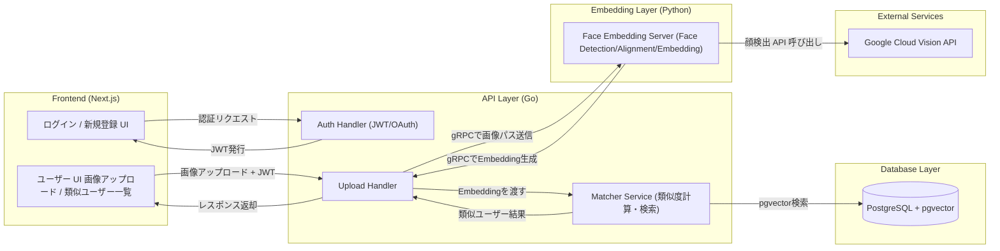

# 顔マッチングサービス — 仕様書
## 概要
このサービスは、オーストラリアの「ペットと里親の顔マッチング」アプリの着想を得て、人間版として実装するものです。
人はこの世に3人ドッペルゲンガーがいると言われます。
ユーザーがアップロードした顔画像をもとに、「似ている他のユーザー」を検出・提示し、簡易チャットでつながれる Web アプリケーションです。
顔特徴の抽出サービス（Python）とアプリケーションロジック（Go）は gRPC で接続する。
フロントエンドは Next.js + TypeScript を想定（Web メイン）。将来 Flutter / Swift に移植する予定。

# 1.要件サマリ
## 機能 (MVP)
- ユーザー登録/ログイン
- 顔画像のアップロード
- 顔特徴量(embedding)の生成、保存
- 類似ユーザーの検索
- 類似度スコアの表示
- 類似ユーザーとのチャット(WebSocket)

# 2. 全体図


# 3. ディレクトリ構成
```
```

<!-- websocketによるチャット機能をfrontendのflowchart LR追加する -->

# 4. 処理の流れ
### ① Frontend → Go API
Next.jsから画像をアップロードする

### ② Go → Python (gRPC)
画像をGo APIからPythonサーバへ送る。
Pythonは以下のものを担当する。
- 顔検出（Vision API）
- 顔前処理 (アライメント)
- 512次元 embedding 抽出

### ③ Python → Go (gRPC)
PythonからembeddingをGoに返す。

### ④ 類似度検索をGoが行う
- embedding を受け取り
- pgvector で類似検索
- コサイン類似度でスコア算出する
- 類似ユーザー一覧を返却する

### ⑤ Go → Frontend
結果 (似ているユーザー)を返す。

# 5. アーキテクチャ詳細 (クリーンアーキテクチャ & DDD の採用)


# 6. フロントエンド仕様 (Next.js+TypeScript)
## 主要ページ
- /singup, /login
- /profile：プロフィール編集 (名前、写真、公開範囲)
- /upload：顔写真アップロード
- /matches：類似ユーザー一覧 (スコア、サムネイル、チャットボタン)
- /chat/[userId]：チャット画面

## なぜNext.jsを採用するか、Reactとの比較

## TypeScriptを採用する理由

# 7. バックエンド仕様 (Go)
## GolangとPythonの比較

<!-- あとで詳細図で別に飛ばす -->
# 8. 顔認証/顔類似性サービス (Python)

<!-- あとで詳細図で別に飛ばす -->
# 9. API仕様書 (REST for frontend, gRPC for service間)

<!-- あとで詳細図で別に飛ばす -->
# 10. DBデータモデル


