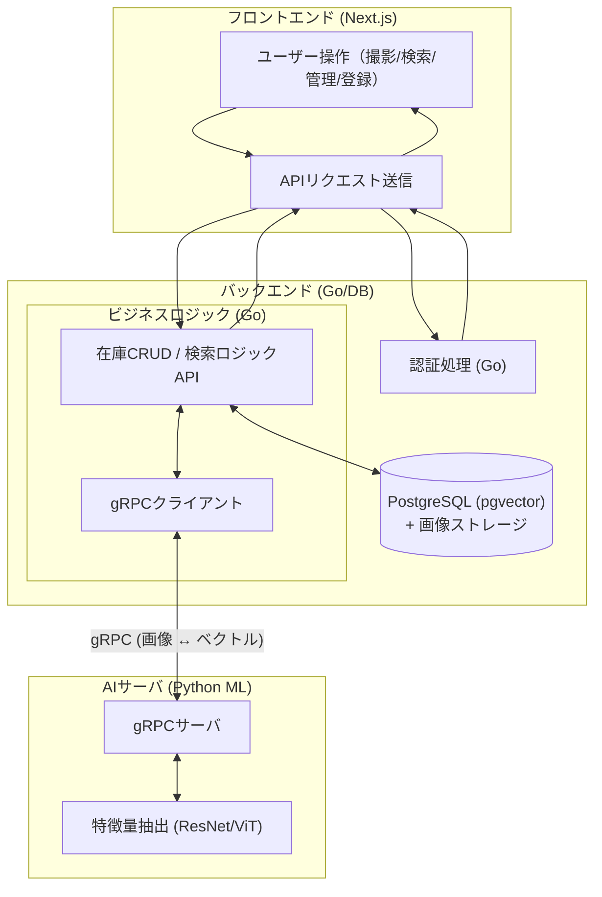

# Daburi Zero — 仕様書
「これ、家にあったっけ？」「家にあるのにまた同じものを買ってしまった。。。」を画像検索で解決する、うっかり重複買い防止プラットフォーム

## 概要
「Daburi Zero」は、洗剤、調味料、掃除用具など、日用品の「ダブリ買い」をゼロにするための管理アプリです。本サービスでは、「画像（パッケージデザイン）そのもの」をベクトル化して検索することで、在庫状況を照合する体験を提供します。

# 1.要件サマリ
- 商品を撮影するだけで在庫登録・検索ができること
- 画像の類似度（特徴量ベクトル）に基づいて、既存在庫との一致を判定すること
- 在庫の有無を「％（類似度）」と「画像比較」で直感的にユーザーへ伝えること
- 外出先（オフラインに近い環境）でも高速に検索結果を返せること

## 機能 (MVP)
1. 認証・セッション管理 (Redis)
    - ID/パスワードによる認証。
    - ログイン成功後、セッションIDを発行しRedisに保存する。
    - 以降のリクエストはRedis上のセッション情報で認可を行う。

2. 自宅備品マネジメント (CRUD)
    - 商品登録 (Create)：
        - スマホで商品を撮影 → 商品名をそのままAIが登録する。商品名入力すらも無くしたい。
        - Pythonでベクトル化し、メタデータと共に保存。
    - 在庫一覧・詳細 (Read)：
        - 登録した商品をリスト表示。
        - 商品からどういう要素をカラムとして持たせるか
    - 在庫編集 (Update)：
        - ストックが切れたのでなしにする。商品名を変えるなどの操作ができる。
    - 在庫削除 (Delete)：
        - 使わなくなったアイテムの削除。

3. 店頭照合機能
- リアルタイム検索：
    - 店頭で「これ持ってたっけ？」と思った時にカメラで撮影。
    - 「今撮った写真」 と 「DB内の全在庫ベクトル」で高速類似度検索。
- 判定フィードバック：
    - 持っています（類似度95%：画像表示）
    - 似たものがあります（類似度75%：以前撮った画像と並べて比較）
    - 持っていないようです（類似度低）」といった結果を表示。

## 使用技術
1. バックエンド / AWS
- 言語：Go
- 認証・セッション：Redis
- データベース：PostgreSQL + pgvector (画像ベクトルの高速検索を実現)
- 通信プロトコル: gRPC + Protocol Buffers (Go-Python間の高速・型安全な通信)
- ストレージ：MinIO または AWS S3 (撮影した画像データの保存)

2. 機械学習解析 (Python ML Server)
- 言語：Python(Deep Learningライブラリが豊富なため)
- 特徴量抽出: PyTorch + Vision Transformer (ViT) (パッケージの類似性を数値化)
- 商品名抽出 (OCR/VLM):
    - EasyOCR: 文字があるパッケージから名前を抜く。
    - Moondream2 または Llama-3.2-Vision: 文字がない掃除用具などの名前を推論。
- API：gRPC Server (Goからの解析依頼を待ち受ける)

3. フロントエンド
- フレームワーク: Next.js (TypeScript)
- スタイリング: Tailwind CSS
- カメラ機能: react-hook-form + カスタムフック (スムーズな撮影・アップロード体験)


# 2. 全体図


# 3. ディレクトリ構成
backend
```
go-backend/
├── cmd/
│   └── api/
│       └── main.go           # エントリーポイント (DB/Redis接続、DI、サーバー起動)
├── internal/
│   ├── domain/               # ビジネスロジックの中心 (外部に依存しない純粋な定義)
│   │   ├── entity/           # エンティティ (データ構造)
│   │   │   ├── user.go       # User (ID, Email, PasswordHash)
│   │   │   └── item.go       # Item (ID, Name, ImageURL, Embedding, Status)
│   │   ├── repository/       # インターフェース定義
│   │   │   ├── user_repo.go  # Userデータの永続化IF
│   │   │   └── item_repo.go  # Itemデータの永続化IF (pgvector検索含む)
│   │   └── service/          # ドメインサービス
│   │       └── matching.go   # 類似度(%)に基づいた判定ロジック (95%なら一致など)
│   │
│   ├── usecase/              # アプリケーションロジック (ユースケース)
│   │   ├── auth_usecase.go   # ログイン・セッション管理 (Redis連携)
│   │   ├── item_usecase.go   # 商品登録、一覧取得、更新、削除
│   │   ├── search_usecase.go # 店頭照合 (画像送信 -> ベクトル化 -> 近傍検索)
│   │   └── inputport/        # DTO (リクエスト/レスポンス用データ構造)
│   │
│   ├── presentation/         # 外部との接点（ここを Presentation に変更）
│   │   │   ├── controller/   # (item_handler.go など)
│   │   │   └── middleware/
│   │
│   └── infrastructure/       # 技術的な詳細実装
│       ├── persistence/      # リポジトリの実装 (PostgreSQL + pgvector)
│       │   ├── db.go         # SQL接続管理
│       │   ├── user_repo.go  # usersテーブル操作
│       │   └── item_repo.go  # itemsテーブル & vector検索操作
│       ├── redis/            # Redisクライアント (セッション保存/取得)
│       │   └── session.go
│       ├── grpc/             # ML Layer (Python) へのクライアント
│       │   └── ml_client.go  # 画像を投げて「ベクトルと名前」を受け取る
│       ├── storage/          # オブジェクトストレージ (MinIO/S3)
│       │   └── image_store.go
│       └── router/           # Echo/Gin などのルーティング設定
│
├── pkg/                      # 汎用ツール (Logger, Config, Errors)
├── api/                      # 通信定義
│   └── proto/
│       └── ml_service.proto  # Python側との通信定義 (AnalyzeImage RPCなど)
├── go.mod
└── go.sum
```

frontend
```
frontend/
├── src/
│   ├── api/                   # services から改名（Go側の infrastructure/persistence と対になる）
│   │   ├── axios.ts           # 共通設定（BaseURL, Headerなど）
│   │   ├── auth.ts            # ログイン・会員登録関連
│   │   └── inventory.ts       # 在庫照合・リスト取得関連
│   ├── components/
│   │   ├── common/            # 使い回す部品（Button, Input, Loading等）
│   │   └── layout/            # 画面の枠組み（Header, BottomNav等）
│   ├── features/              # 【心臓部】機能ごとの「部品 + ロジック」
│   │   ├── auth/              # LoginForm や useAuthHook
│   │   ├── inventory/         # InventoryList や 在庫編集ロジック
│   │   └── camera/            # カメラ起動・画像プレビュー・照合ロジック
│   ├── pages/                 # ルーティングの「受け皿」
│   │   ├── Home.tsx           # あのシンプルな「これ持ってたっけ？」画面
│   │   ├── Login.tsx
│   │   ├── Register.tsx
│   │   └── Inventory.tsx      # 在庫一覧画面
│   ├── routes/
│   │   └── AppRoutes.tsx      # react-router-dom の定義
│   ├── hooks/                 # 共通フック（useLocalStorage, useDebounce等）
│   ├── context/               # AuthContext（ログイン状態のグローバル管理）
│   ├── utils/                 # ヘルパー関数（日付変換、画像圧縮等）
│   ├── App.tsx                # ルート
│   └── main.tsx               # エントリーポイント
└── .env                       # VITE_API_URLなどを定義
```

<!-- websocketによるチャット機能をfrontendのflowchart LR追加する -->

# 4. 処理の流れ
### ① Frontend → Go API
- 画像アップロード
    - Next.js から顔画像をアップロードする
    - 画像は multipart/form-data 形式で送信される
    - 認証済みユーザーのみ利用可能とする

### ② Go → Python (gRPC)
画像をGo APIからPythonサーバへ送る。
Pythonは以下のものを担当する。
- 顔検出（Vision API）
- 顔前処理 (アライメント)
- 512次元 embedding 抽出

### ③ Python → Go (gRPC)
- 解析結果の返却
    - 顔 Embedding（512次元ベクトル）

### ④ 類似度検索をGoが行う
- 検索および永続化
Go APIは以下を担当します。
- 受け取ったEmbeddingをデータベースに保存
    - ベクトル検索：pgvector
- 顔検索時は、Embeddingを用いて類似度計算を実行
- 類似度順にユーザーをソート (TOP N抽出)
※ 類似度検索のロジックはGo側で一元管理する。

### ⑤ Go → Frontend
- 検索結果の返却
    - 類似度順に並んだユーザー一覧
    - 顔サムネイル
    - 最低限のプロフィール情報
    - 類似度指標 (相対スコア)
Frontedは結果を表示し、ユーザーは気になった相手に1日3件までメッセージを送ることができる。

# 4-1. 機能要件

# 4-2. 非機能要件

# 5. アーキテクチャ詳細 (クリーンアーキテクチャ & DDD の採用)


# 6. フロントエンド仕様 (React+TypeScript)
## 主要ページ

## Next.jsとReactの比較

## TypeScriptを採用する理由

# 7. バックエンド仕様 (Go)
## GolangとPythonの比較

<!-- あとで詳細図で別に飛ばす -->
# 8. 顔認証/顔類似性サービス (Python)

<!-- あとで詳細図で別に飛ばす -->
# 9. API仕様書 (REST for frontend, gRPC for service間)

<!-- あとで詳細図で別に飛ばす -->
# 10. DBデータモデル

# 11.コミットメッセージについて(12/21〜)
コミットメッセージが適当だったのでいかを基準にします。
- add: 新しい機能
- fix: バグの修正 (ほぼないかも)
- docs: ドキュメントの変更
- update: 機能修正(機能削除も含める)
- update_file: go.sum,go.modのファイル変更
- remove: ファイルの削除
- refactor: コード改善(リファクタ)