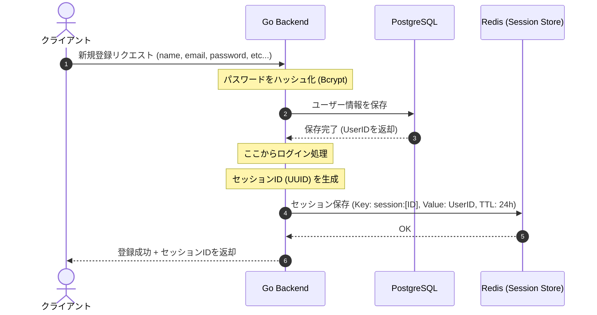
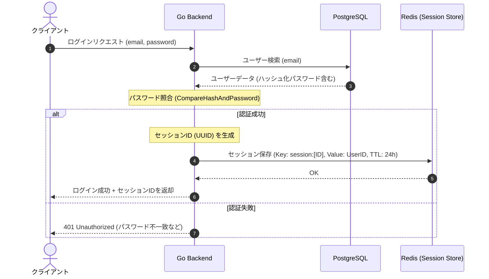
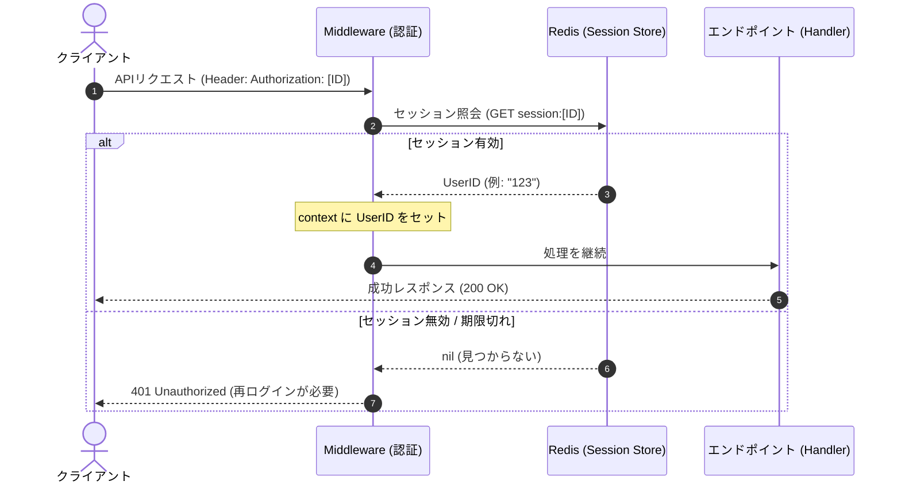

# 認証フロー
Destiny Face 顔マッチングサービスの認証・認可フロー図です。本システムでは Redis を使用したセッション管理方式を採用しています。

## 新規登録時 (セッション発行)
ユーザー作成と同時にログイン状態へ移行するためのフローです。

## ログイン実行時 (セッション発行)
既存ユーザーの認証を行い、新規セッションを開始するフローです。

## 認証が必要なリクエスト時 (Middleware)
保護されたリソースへアクセスする際、セッションが有効かどうかを検証するフローです。
