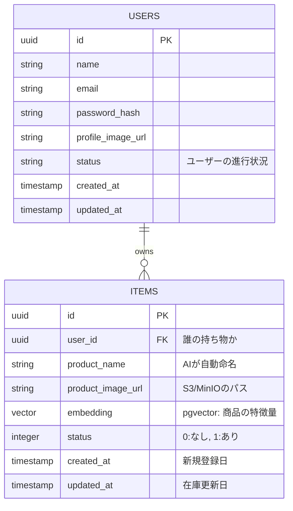

<!-- ER図について考える -->

## データベース設計 (PostgreSQL + pgvector) (ベクトル検索)

アプリケーションのコアとなる2つのテーブルと、そのリレーションを示します。

### 1. ER図 (実体関連図)

# 2. テーブル詳細（スキーマ定義）

## 2-1. **Users テーブル**

ユーザーの基本情報と認証情報を管理します。

| カラム名          | データ型         | 制約               | 説明              |
| ------------- | ------------ | ---------------- | --------------- |
| id            | UUID         | PK               | ユーザーの主キーID      |
| email         | VARCHAR(255) | UNIQUE, NOT NULL | 認証用メールアドレス      |
| password_hash | TEXT         | NOT NULL         | パスワードのハッシュ値     |
| name          | VARCHAR(50)  | NOT NULL         | アプリ内で表示されるユーザー名 |
| profile_image_url | TEXT     | なし         | 表示用写真のURLパス |
| status | VARCHAR(50)     | NOT NULL         | ユーザーの進行状況 |
| created_at    | TIMESTAMP    | NOT NULL         | 登録日時            |
| updateded_at    | TIMESTAMP    | NOT NULL         | 更新日時            |

## 2-2. **Faces テーブル**

「Daburi Zero」の本体。画像ベクトルと在庫状態をセットで保持する。

| カラム名          | データ型         | 制約               | 説明              |
| ------------- | ------------ | ---------------- | --------------- |
| id            | UUID         | PK               | ユーザーの主キーID      |
| user_id            | UUID         | FK, NOT NULL       | どのユーザーの在庫か      |
| product_name  | TEXT         | NOT NULL    | 写真からAIが判定した名前     |
| product_image_url  | TEXT         | NOT NULL    | ストレージに保存された実物写真のパス     |
| embedding  | VECTOR(512)  | NOT NULL    | pgvector： 類似度検索に使う512次元ベクトル  |
| status  | INTEGET  | NOT NULL    | 0: なし, 1: あり (買い物リスト抽出に利用)  |
| created_at  | TIMESTAMP  | NOT NULL    | この商品が初めて「記憶（登録）」された日時 |
| updated_at  | TIMESTAMP  | NOT NULL    | 在庫状態が変わった、または再スキャンされた日時 |