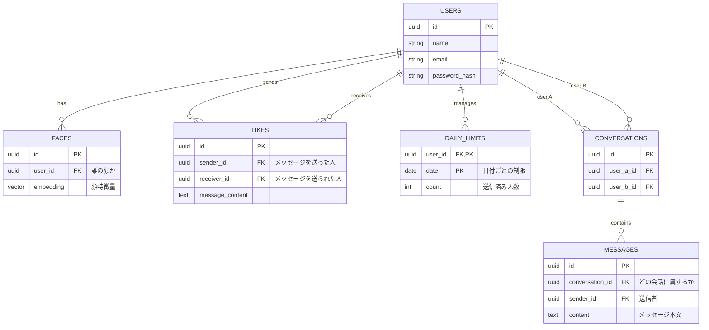

<!-- ER図について考える -->

## データベース設計 (PostgreSQL + pgvector) (ベクトル検索)

アプリケーションのコアとなる6つのテーブルと、そのリレーションを示します。

### 1. ER図 (実体関連図)

# 2. テーブル詳細（スキーマ定義）

## 2-1. **Users テーブル**

ユーザーの基本情報と認証情報を管理します。

| カラム名          | データ型         | 制約               | 説明              |
| ------------- | ------------ | ---------------- | --------------- |
| id            | UUID         | PK               | ユーザーの主キーID      |
| email         | VARCHAR(255) | UNIQUE, NOT NULL | 認証用メールアドレス      |
| password_hash | VARCHAR(255) | NOT NULL         | パスワードのハッシュ値     |
| name          | VARCHAR(50)  | NOT NULL         | アプリ内で表示されるユーザー名 |
| created_at    | TIMESTAMP    | NOT NULL         | 登録日時            |

## 2-2. **Faces テーブル**

ユーザーに紐づく顔特徴量（ベクトル）を管理します。

| カラム名       | データ型        | 制約       | 説明             |
| ---------- | ----------- | -------- | -------------- |
| id         | UUID        | PK       | 顔データID         |
| user_id    | UUID        | FK       | 関連するユーザーID     |
| embedding  | VECTOR(512) | NOT NULL | 512次元の顔特徴量ベクトル |
| is_primary | BOOLEAN     | NOT NULL | メイン顔写真かどうかのフラグ |
| created_at | TIMESTAMP   | NOT NULL | 登録日時           |

## 2-3. **Likes テーブル（中間テーブル）**

初手メッセージの送信記録、多対多の関連、重複・制限チェックに使用。

| カラム名            | データ型      | 制約       | 説明                          |
| --------------- | --------- | -------- | --------------------------- |
| id              | UUID      | PK       | レコードID                      |
| sender_id       | UUID      | FK       | 初手メッセージを送ったユーザーID           |
| receiver_id     | UUID      | FK       | 初手メッセージを送られたユーザーID          |
| message_content | TEXT      |          | 初手メッセージ本文                   |
| created_at      | TIMESTAMP | NOT NULL | 送信日時（Daily_Limits のカウントに使用） |

## 2-4. **Daily_Limits テーブル**

| カラム名    | データ型    | 制約       | 説明                |
| ------- | ------- | -------- | ----------------- |
| user_id | UUID    | PK, FK   | 制限対象のユーザー         |
| date    | DATE    | PK       | 対象日付 (YYYY-MM-DD) |
| count   | INTEGER | NOT NULL | その日の初手メッセージ送信数    |

## 2-5. **Conversations テーブル**

チャットルームを定義し、メッセージのまとまりを管理。

| カラム名       | データ型      | 制約       | 説明                   |
| ---------- | --------- | -------- | -------------------- |
| id         | UUID      | PK       | チャットルーム識別ID          |
| user_a_id  | UUID      | FK       | 会話参加者A（IDが小さい方を格納推奨） |
| user_b_id  | UUID      | FK       | 会話参加者B               |
| created_at | TIMESTAMP | NOT NULL | 会話開始日時               |

## 2-6. **Messages テーブル**

会話のメッセージ（履歴）を記録。

| カラム名            | データ型      | 制約       | 説明           |
| --------------- | --------- | -------- | ------------ |
| id              | UUID      | PK       | メッセージ個別ID    |
| conversation_id | UUID      | FK       | 紐づくチャットルームID |
| sender_id       | UUID      | FK       | メッセージ送信者     |
| content         | TEXT      | NOT NULL | メッセージ本文      |
| created_at      | TIMESTAMP | NOT NULL | 送信日時         |
